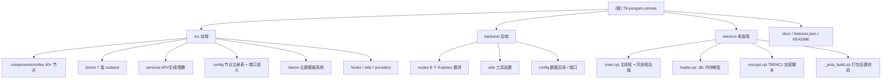

# T8-penguin-canvas · AI 节点画布工作流（CLAUDE 工程索引）

> 版本：v1.5.3 · 扫描时间：2026-05-27 18:35:23
>
> 文档目的：为 Claude / AI 协作者提供「全局架构入口 + 模块文档导航」。源代码不动，只读 + 索引。

---

## 一、项目愿景

T8-penguin-canvas（贞贞的无限画布 · 企鹅共创版）是一款 **AI 节点式创作工作流工具**：

- 拖拽 30+ 业务节点编排「文本 / 图像 / 视频 / 音频 / LLM / RunningHub」生成链路
- 支持画布级批量执行（Kahn 拓扑排序）、智能对齐、GroupBox 打组、跨节点素材拖拽、撤销/重做、JSON 导入/导出
- 内置三套主题模板（科技风 / 像素糖果风 / OP 风格）× 浅/深 × 双视觉，可导入自定义模板
- 一键打包为 Windows 桌面端（Electron + NSIS + bytenode T8ENC1 加密后端字节码）

技术栈速记：**React 19 + TypeScript 5 + Vite 6 + xyflow 12 + zustand 5 + Tailwind 3** 前端 / **Node + Express + sharp + multer** 后端 / **Electron 33 + electron-builder 25** 桌面端。

---

## 二、架构总览

```
┌────────────────────────────────────────────────────────────────────────────┐
│                         Electron 桌面端 (electron/)                         │
│   主进程 main.cjs ── 内存解密 .t8c (loader.cjs) ── 同进程拉起 Express      │
│   preload.cjs IPC 桥接                                                      │
└──────────────┬──────────────────────────────────────────┬──────────────────┘
               │                                          │
   ┌───────────▼────────────┐                ┌────────────▼──────────────┐
   │   前端 SPA (src/)       │  Vite proxy   │   后端 API (backend/)      │
   │   xyflow 画布 + zustand │ ◀───────────▶ │   Express 路由层           │
   │   nodes / stores / svc  │   /api/*       │   8 个 router 模块         │
   │   港口 11422            │   /files/*     │   端口 18766               │
   └─────────────────────────┘                └────┬───────────────────────┘
                                                   │
                            ┌──────────────────────┼──────────────────────┐
                            ▼                      ▼                      ▼
                    贞贞工坊 / LLM         RunningHub / RH-Wallet      支付 VPS
                    (image/video/audio)    (工作流 / 钱包应用)         pay.t8star.org
```

**数据流四层**：
1. **画布 UI 层** —— `src/components/Canvas.tsx` + `src/components/nodes/*` 渲染 + 交互
2. **状态总线层** —— `src/stores/{canvas,runBus,logs,theme,apiKeys,dragMaterial,groupBus}.ts` 7 套 zustand store
3. **API 服务层** —— `src/services/{api,generation,imageOps}.ts` 封装后端调用 + 任务轮询
4. **后端代理层** —— `backend/src/routes/proxy.js` 注入 API Key、转存远端资源、轮询上游任务

---

## 三、模块结构图（Mermaid）



---

## 四、模块索引

| 模块 | 路径 | 角色 | 入口 | 文档 |
|---|---|---|---|---|
| 前端 SPA | `src/` | React 19 画布应用 | `src/main.tsx` → `src/App.tsx` | [src/CLAUDE.md](./src/CLAUDE.md) |
| 后端 API | `backend/` | Node + Express 代理服务（端口 18766） | `backend/src/server.js` | [backend/CLAUDE.md](./backend/CLAUDE.md) |
| Electron 桌面端 | `electron/` | 主进程 + bytenode/T8ENC1 加密装载 | `electron/main.cjs` | [electron/CLAUDE.md](./electron/CLAUDE.md) |
| 文档/锁文件 | `docs/`, `features.json`, `README.md` | 节点防丢失锁 + 主题设计规范 + 项目说明 | `features.json` | (见根 README) |

---

## 五、运行与开发

### 环境要求
- Node.js ≥ 18 · npm
- Windows / macOS / Linux 浏览器（推荐 Chromium 内核）
- Windows 系统（用于 Electron 打包）

### 关键脚本（根 `package.json`）

| 命令 | 作用 |
|---|---|
| `npm install` + `cd backend && npm install` | 安装前后端依赖 |
| `npm run dev` | concurrently 同时拉起后端（18766）+ Vite 前端（11422） |
| `npm run dev:vite` / `npm run dev:backend` | 单独启前端 / 后端 |
| `npm run type-check` | `tsc --noEmit` 类型检查 |
| `npm run build` | `tsc -b && vite build` 出前端产物到 `dist/` |
| `npm run lint` | ESLint TypeScript 检查 |
| `npm run electron:dev` | 开发模式启动 Electron |
| `npm run encrypt` | 用 Electron 内置 Node 跑 bytenode + T8ENC1，输出 `build/backend-enc/*.t8c` |
| `npm run dist:dir` | 出 win-unpacked 目录（不打 NSIS） |
| `npm run dist` | 出最终 `dist_electron/T8-PenguinCanvas-Setup-<version>.exe` |

### 关键端口

- 前端开发：`http://127.0.0.1:11422`
- 后端 API：`http://127.0.0.1:18766`
- Vite proxy 转发 `/api`、`/files`、`/output`、`/input` 到后端

### 数据目录（运行时）

- **开发模式**：项目根 `data/` · `input/` · `output/` · `thumbnails/`
- **打包模式**：`%APPDATA%/t8-penguin-canvas/{data,input,output,thumbnails}`（由 `T8PC_USER_DATA` 注入）
- `data/settings.json` 持久化 API Key、保存路径、偏好
- `data/canvas_*.json` 每张画布一文件 + `canvas_list.json` 元数据列表

---

## 六、测试策略

> ⚠️ 当前仓库**无自动化测试目录**（`__tests__/`、`*.spec.*`、`*.test.*` 均不存在）。

人工质量门：
- `npm run type-check`（TS 严格类型校验）
- `npm run build` 必须通过（PR 前置条件）
- 关键改动需同步更新 `features.json`（节点防丢失锁）与本地私有 `skill.md`
- Electron 打包后由 `electron/_post_build.cjs` 校验：11 个 `.t8c` 必存、`resources/frontend/index.html` 必存、主题音乐资源完整、清除明文 src 残留、扫描充值密钥泄漏

调试入口：
- 前端：浏览器 DevTools；`src/components/TerminalPanel.tsx` 底部抽屉式日志面板
- 后端：终端 `[hh:mm:ss] METHOD /path` 简易访问日志（`backend/src/server.js:20-24`）
- Electron：`logBuffer`（`main.cjs`）+ 日志窗口

---

## 七、编码规范

- **TypeScript 严格模式**（`tsconfig.json`），React 19 函数组件 + hooks
- **状态管理**：zustand（避免 Context 风暴）；总线模式（`runBus` / `groupBus` / `dragMaterial`）解耦节点 ↔ Canvas
- **样式**：Tailwind utility-first + CSS Modules + 主题 CSS 变量（`--t8-*` / `--theme-*` / `--px-*`）。新组件应优先使用变量，避免硬编码颜色
- **节点开发铁律**（来自 `features.json` + 历史 phase）：
  1. 任何节点删减必须在 `features.json` 中记录
  2. 节点 `type` 字符串一旦发布禁止改动（兼容老画布数据）
  3. 用 `useRunTrigger(id, runFn)` 接入运行总线 + `logBus.{info|debug|warn|error}` 同步日志
  4. xyflow v12 节点内部 `<textarea>` / `<input>` 必须有 `nodrag nowheel` 类（`App.tsx` 全局 MutationObserver 自动注入）
  5. 使用 `useUpstreamMaterials(id)` 订阅上游素材，避免手动遍历 edges/nodes 引发 stale closure
  6. RH 节点重构时必须保留 9 个 logBus 调用点（见 `phase29` 防再丢失规范）
- **Git 提交规范**：Conventional Commits（`feat:` / `fix:` / `chore:` / `docs:`）
- **版本号规则**：v1.3.0 起统一三段 `x.y.z`；阶段内 1.x.1~1.x.9，下一阶段 1.(x+1).0。
  - 必须四处同步：`package.json` / `package-lock.json` / `vite.config.ts` 的 `__APP_VERSION__` / `electron/main.cjs` 三处版本号 / `backend/src/config.js` `APP_VERSION` / `features.json.version`

---

## 八、AI 使用指引

如果你（Claude / Copilot 等）需要修改本项目，**强烈建议先阅读模块文档**：

| 你的任务 | 优先阅读 |
|---|---|
| 新增 / 修改业务节点 | [src/CLAUDE.md](./src/CLAUDE.md) §节点目录 · `features.json` 节点锁 · `src/config/nodeRegistry.ts` |
| 新增上游 AI 服务代理 | [backend/CLAUDE.md](./backend/CLAUDE.md) §代理路由 · `backend/src/routes/proxy.js` |
| 打包 / 加密 / 桌面端集成 | [electron/CLAUDE.md](./electron/CLAUDE.md) §打包链路 · `electron/_post_build.cjs` 校验项 |
| 主题 / 视觉调整 | `src/theme/` · `src/styles/theme-*.css` · `docs/theme-design-guide.md` |
| 端口连接语义 | `src/config/portTypes.ts`（NODE_PORTS） · `src/types/canvas.ts` |
| 调试运行总线 | `src/stores/runBus.ts` · `src/hooks/useRunTrigger.ts` |
| 修改 / 新增 LLM 推理接入 | [docs/llm-inference.md](./docs/llm-inference.md) §后端代理路由 · `src/components/nodes/LLMNode.tsx` · `src/providers/models.ts` |

**注意事项**：
- 不要随意 `git pull --rebase`（参考 `phase29` 灾难抢救历史），改用 merge 或新分支
- 不要在公开仓库中提交：`AGENT_HMAC_KEY` / `DULUPAY_KEY` / `RECHARGE_DEFAULT_ENC` 真值 / `data/recharge.private.json`
- 修改 `backend/src/**` 后须重新 `npm run encrypt` 才能打 Electron 包
- 涉及节点删除需先 `hidden: true`（保留 nodeTypes 注册兼容老画布），而非直接移除

---

## 九、变更记录 (Changelog)

| 日期 | 变更 |
|---|---|
| 2026-05-27 | 初次生成 CLAUDE.md（根 + src + backend + electron）；扫描覆盖率 ~100%（所有源码模块） |
| 2026-05-28 | v1.5.9：七牛 `openai/gpt-image-2` image-edits size 修复 + 1K/2K/4K 清晰度档；grsai `gpt-image-2-vip` 「比例 × 清晰度」双控件（`sizeMap` 按上游文档铺 14 比例 × 3 档预设表，1:3/3:1 在 2K 档由 `computeVipSize` 4MP 兜底；vip 比例列表去 auto + 加 1:3/3:1/2:1/1:2 共 4 项 vip 独有比例） |
| 2026-05-28 | v1.6.1：合并 upstream/main → upstream v1.5.8 主题图标 / 跨平台路径 + v1.5.9 EVA 主题 + v1.6.0 EVA 浅色 legacy adapter；fork phase77/78 与 upstream 撞 JSON key，重命名为 phase80/81 + 新增 phase82 anchor |
| 2026-05-28 | v1.6.2：修复七牛 `gemini-3.1-flash-image-preview` 比例参数不生效（根因：`callQiniuImageUpstream` 把所有子模型按 OpenAI body 发，gemini 上游需要 `image_config.{aspect_ratio,image_size}` 嵌套对象，收到顶层 `size` 会静默忽略）。按 `model` 分流构造 body，gemini 走 image_config、openai/gpt-image-2 维持 size/quality；UI 让 gemini 也显示 1K/2K/4K 清晰度档 |
| 2026-05-30 | 新增 LLM 推理专项文档 `docs/llm-inference.md`（覆盖前端节点/服务层/后端代理/配置项/类型定义） |

---

## 九、Fork 版本策略（重要）

**规则**：本 fork 版本号必须**永远领先 upstream/main 至少一个版本号**。

### 为什么需要这个策略？

1. **避免版本冲突**：防止 fork 版本号与 upstream 版本号重叠
2. **明确标识**：清晰区分 fork 分支与 upstream 的独立演进
3. **防止回退**：避免合并 upstream 后版本号"倒退"的混淆

### 如何执行？

**合并 upstream 后立即检查**：
- 如果 upstream 版本号 ≥ fork 当前版本，必须递增 fork 版本
- 示例：upstream 1.7.4 → fork 必须升级到 1.8.0（次版本号递增）

**版本号同步位置（7 处）**：
1. `package.json` - version 字段
2. `vite.config.ts` - __APP_VERSION__
3. `vite.config.js` - __APP_VERSION__
4. `backend/src/config.js` - APP_VERSION
5. `electron/main.cjs` - 窗口标题（第 171 行）
6. `electron/main.cjs` - 日志窗口（第 224 行）
7. `electron/main.cjs` - IPC version（第 250 行）
8. `features.json` - version/semverVersion/versionNote
9. `README.md` - 版本徽章

**示例**：
```bash
# 合并 upstream v1.7.4 后
git merge upstream/main
# 立即升级版本到 1.8.0
# 修改上述 7 处文件
git commit -m "chore: 升级版本到 v1.8.0（fork 版本策略）"
```

### 当前状态

- **Fork 版本**：v1.8.0
- **Upstream 版本**：v1.7.4
- **领先状态**：✅ 领先一个次版本号

---

## 十、变更记录 (Changelog)

| 日期 | 变更 |
|---|---|
| 2026-05-27 | 初次生成 CLAUDE.md（根 + src + backend + electron）；扫描覆盖率 ~100%（所有源码模块） |
| 2026-05-28 | v1.5.9：七牛 `openai/gpt-image-2` image-edits size 修复 + 1K/2K/4K 清晰度档；grsai `gpt-image-2-vip` 「比例 × 清晰度」双控件（`sizeMap` 按上游文档铺 14 比例 × 3 档预设表，1:3/3:1 在 2K 档由 `computeVipSize` 4MP 兜底；vip 比例列表去 auto + 加 1:3/3:1/2:1/1:2 共 4 项 vip 独有比例） |
| 2026-05-28 | v1.6.1：合并 upstream/main → upstream v1.5.8 主题图标 / 跨平台路径 + v1.5.9 EVA 主题 + v1.6.0 EVA 浅色 legacy adapter；fork phase77/78 与 upstream 撞 JSON key，重命名为 phase80/81 + 新增 phase82 anchor |
| 2026-05-28 | v1.6.2：修复七牛 `gemini-3.1-flash-image-preview` 比例参数不生效（根因：`callQiniuImageUpstream` 把所有子模型按 OpenAI body 发，gemini 上游需要 `image_config.{aspect_ratio,image_size}` 嵌套对象，收到顶层 `size` 会静默忽略）。按 `model` 分流构造 body，gemini 走 image_config、openai/gpt-image-2 维持 size/quality；UI 让 gemini 也显示 1K/2K/4K 清晰度档 |
| 2026-05-30 | 新增 LLM 推理专项文档 `docs/llm-inference.md`（覆盖前端节点/服务层/后端代理/配置项/类型定义） |
| 2026-05-31 | v1.8.0：合并 upstream v1.7.0→v1.7.4（节点片段、任务完成音效、姿势大师、连接导航）+ fork 新增 Geeknow LLM 节点；建立 fork 版本策略（永远领先 upstream 至少一个版本号） |

---

## 十一、扫描元数据

- 总文件数：≈115（不含 node_modules / data / dist / build / dist_electron / public 资源）
- 已扫描模块：3（src · backend · electron）
- 已扫描入口/路由/类型文件：约 25 个关键文件
- 忽略：`node_modules/`、`.git/`、`data/`、`input/`、`output/`、`thumbnails/`、`build/`、`dist*/`、`*.lock`、`*.log`、二进制资源
- 索引文件：[.claude/index.json](./.claude/index.json)
