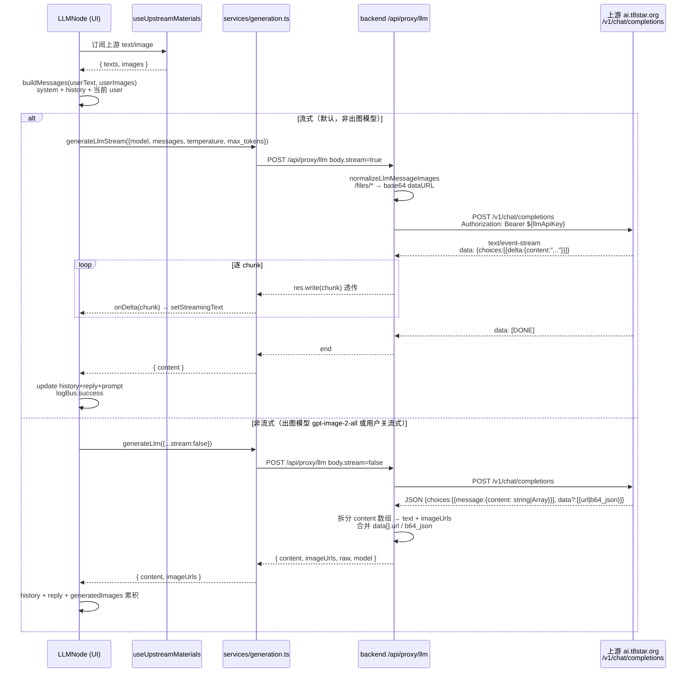

# LLM 推理专项文档（T8-penguin-canvas）

> 版本：v1.0 · 扫描时间：2026-05-30 09:05:52 · 对应代码版本：v1.7.3
>
> 本文档聚焦「LLM / Vision 大模型推理子系统」在 T8-penguin-canvas 中的接入链路。覆盖前端节点 → 服务层 → 后端代理 → 上游 → 流回的完整路径，所有引用以 `相对路径:行号` 锚定，方便后续修改回溯。

---

## 一、概览

### 1.1 角色定位

LLM 推理子系统在 T8-penguin-canvas 中**只对应一类业务节点**：`type='llm'` 的 `LLMNode`（`src/components/nodes/LLMNode.tsx`）。功能上对齐 `gpt-image-2-web` 项目的 Chat Tab（参见节点头部注释 `LLMNode.tsx:40-52`）：

- 5 个内置模型：`gemini-3.1-flash-lite-preview`（默认）/ `gpt-4o` / `gemini-3.1-pro-preview` / `gpt-5` / `gpt-image-2-all`
- 多轮会话（user / assistant / system）+ 多模态（文本 + 图片）
- 流式 SSE 增量更新（默认开启，仅出图模型 `gpt-image-2-all` 走非流式）
- 系统提示词预设保存/加载（localStorage `t8-llm-sys-presets`）
- 出图模型可返回 `image_url` 数组（多模态返回）

### 1.2 数据流图

```mermaid
graph LR
    A[LLMNode 用户输入] --> B[buildMessages]
    B --> C[generateLlm/generateLlmStream]
    C --> D["/api/proxy/llm (后端)"]
    D --> E[normalizeLlmMessageImages]
    E --> F[贞贞工坊 /v1/chat/completions]
    F -- SSE 流 --> G[res 透传 SSE]
    F -- JSON --> H[choices[0].message.content]
    G --> I[前端 ReadableStream 解析 delta]
    H --> J[非流式回复 + imageUrls]
    I --> K[onDelta 拼接 streamingText]
    J --> L[update history reply prompt]
    K --> L
```

### 1.3 关键事实速查

| 项 | 值 |
|---|---|
| 唯一 LLM 节点类型 | `llm`（`src/config/nodeRegistry.ts:20`） |
| 唯一 LLM endpoint | `POST /api/proxy/llm`（`backend/src/routes/proxy.js:986`） |
| 上游 URL（固定锁定） | `https://ai.t8star.org/v1/chat/completions`（`backend/src/config.js:65` `ZHENZHEN_BASE_URL` + `proxy.js:1006`） |
| 鉴权字段 | `settings.llmApiKey`（`Bearer ${llmApiKey}`，`proxy.js:1020`） |
| 流式协议 | SSE，逐行 `data:` JSON 增量（`proxy.js:1034-1052` 透传 / `generation.ts:416-446` 解析） |
| 多模态约束 | content 数组中 `image_url.url` 若以 `/files/` 开头会被后端转 base64 dataURL（`proxy.js:284-308`） |
| 端口语义 | `inputs:['text','image']`，`outputs:['text']`（`src/config/portTypes.ts:53`） |

---

## 二、前端 LLM 节点目录

> 全仓仅 1 个 LLM 节点，所有 LLM 功能集中实现。其余节点均不直接调用 `/api/proxy/llm`。

| 节点 type | 显示名 | 文件路径:行号 | 关键字段（`data.*`） |
|---|---|---|---|
| `llm` | LLM | `src/components/nodes/LLMNode.tsx:135-852` | `model` / `userPrompt` / `userPromptMentions` / `system` / `temperature` / `maxTokens` / `stream` / `history[]` / `reply` / `prompt`（=reply 给下游消费）/ `generatedImages[]` / `consumedTexts[]` / `materialOrder[]` |

### 2.1 模型清单（`src/providers/models.ts:486-518`）

```ts
export const LLM_MODELS: LlmModelDef[] = [
  { id: 'gemini-3.1-flash-lite-preview', label: 'gemini-3.1-flash-lite-preview', provider: 'llm-direct', vision: true, contextLength: 1_000_000 },
  { id: 'gpt-4o',                        label: 'GPT-4o',                       provider: 'llm-direct', vision: true, contextLength: 128_000 },
  { id: 'gemini-3.1-pro-preview',        label: 'Gemini 3.1 Pro',               provider: 'llm-direct', vision: true, contextLength: 2_000_000 },
  { id: 'gpt-5',                         label: 'GPT-5',                        provider: 'llm-direct', vision: true, contextLength: 200_000 },
  { id: 'gpt-image-2-all',               label: 'GPT Image 2 All (图文)',       provider: 'llm-direct', vision: true, imageOutput: true, nonStreaming: true, description: '可自动调用图像生成' },
];

export const DEFAULT_LLM_MODEL = 'gemini-3.1-flash-lite-preview';

/** 是否为出图模型(需走非流式 + 检测 generate_image 指令) */
export function isImageOutputLlm(modelId: string): boolean {
  return LLM_MODELS.find((m) => m.id === modelId)?.imageOutput === true;
}
```

| 模型 | provider | vision | imageOutput | nonStreaming | contextLength | 说明 |
|---|---|---|---|---|---|---|
| `gemini-3.1-flash-lite-preview` | `llm-direct` | ✓ |  |  | 1M | 默认模型，速度优先 |
| `gpt-4o` | `llm-direct` | ✓ |  |  | 128K | OpenAI 通用 |
| `gemini-3.1-pro-preview` | `llm-direct` | ✓ |  |  | 2M | Google 大上下文 |
| `gpt-5` | `llm-direct` | ✓ |  |  | 200K | OpenAI 旗舰 |
| `gpt-image-2-all` | `llm-direct` | ✓ | ✓ | ✓ | – | 图文双向，强制非流式；可返回 `image_url` |

`provider` 类型集合（`src/providers/models.ts:6`）：`'zhenzhen' | 'llm-direct' | 'runninghub' | 'qiniu' | 'grsai'`。LLM 全部归类为 `llm-direct`，与图像生成走的 `zhenzhen` 不同——共用同一个上游域名 `https://ai.t8star.org`，但**鉴权使用独立的 `llmApiKey`**（不会 fallback 到 `zhenzhenApiKey`）。

### 2.2 节点关键字段面板

| 字段 | 类型 | 默认值 | 说明 | 行号锚 |
|---|---|---|---|---|
| `model` | `string` | `DEFAULT_LLM_MODEL` | 5 个候选之一 | `LLMNode.tsx:152` |
| `userPrompt` | `string` | `''` | 用户输入框（私有，不暴露下游） | `LLMNode.tsx:157` |
| `system` | `string` | `'你是一个提示词专家，将用户的提示词优化'` | system 角色消息 | `LLMNode.tsx:159` |
| `temperature` | `number` | `0.7` | 范围 0~2，UI 滑块 | `LLMNode.tsx:160` |
| `maxTokens` | `number` | `4096` | 范围 100~128000 | `LLMNode.tsx:161` |
| `stream` | `boolean` | `true` | `false` 时强制非流式；出图模型自动覆盖为 `false` | `LLMNode.tsx:162` |
| `history` | `ChatTurn[]` | `[]` | `{role,text,images?}[]` | `LLMNode.tsx:163` |
| `reply` / `prompt` | `string` | – | 同值，`prompt` 暴露给下游 `useUpstreamMaterials` | `LLMNode.tsx:301-309` |
| `generatedImages` | `string[]` | – | 仅 `gpt-image-2-all` 出图时累积 | `LLMNode.tsx:327` |
| `consumedTexts` | `string[]` | – | 已消化的上游文本 URL，避免下游重复消费 | `LLMNode.tsx:308,330` |

### 2.3 节点端口语义（`src/config/portTypes.ts:53`）

```ts
llm: { inputs: ['text', 'image'], outputs: ['text'] },
```

- 入：上游 `TextNode` / `ImageNode` / `OutputNode` 等的文本与图像
- 出：`reply`（同时写入 `prompt`）作为 `text` 端口给下游消费
- 注：`gpt-image-2-all` 即使返回图也**不通过 image 端口暴露**——`outputs:['text']` 是固定的；图像走 `data.generatedImages` 内部存储 + UI 内拖拽（`data-drag-source`，`LLMNode.tsx:817-832`）

### 2.4 节点注册元数据（`src/config/nodeRegistry.ts:20`）

```ts
{ type: 'llm', label: 'LLM', category: 'core', description: 'GPT-5 / Claude 4.5 / Gemini 2.5(独立 Key)', icon: 'Brain', color: 'emerald' },
```

> 注：description 中的 "Claude 4.5 / Gemini 2.5" 是历史描述，实际 `LLM_MODELS` 中并不包含 Claude 系列，也未配置 `gemini-2.5`。如果要新增 Claude 模型，需要同时改 `LLM_MODELS` 与上游兼容（详见 §九 扩展指南）。

---

## 三、生成服务层（`src/services/generation.ts`）

### 3.1 LLM 相关导出

| 导出 | 行号 | 说明 |
|---|---|---|
| `type LlmContentPart` | `347-349` | `{type:'text',text}` 或 `{type:'image_url',image_url:{url}}`（OpenAI 多模态格式） |
| `interface LlmMessage` | `351-354` | `{role: 'system'\|'user'\|'assistant', content: string \| LlmContentPart[]}` |
| `interface GenerateLlmRequest` | `356-363` | `{model, messages, temperature?, max_tokens?, stream?}` |
| `interface GenerateLlmResult` | `365-371` | `{content, imageUrls?, raw, model}` |
| `function generateLlm` | `373-384` | 非流式 POST `/api/proxy/llm`（自动 `stream:false`） |
| `function generateLlmStream` | `394-446` | 流式 POST `/api/proxy/llm`（自动 `stream:true`），ReadableStream 解析 SSE，回调 `onDelta(chunk)`，支持 `AbortSignal` |
| `function fileToDataUrl` | `449-456` | 用户本地选图 → `data:image/...;base64,...` |

### 3.2 流式解析时序

`generation.ts:394-446` 的核心逻辑：

```ts
const r = await fetch('/api/proxy/llm', {
  method: 'POST',
  headers: { 'Content-Type': 'application/json' },
  body: JSON.stringify({ ...req, stream: true }),
  signal: opts.signal,
});
// 逐字节读取 ReadableStream
const reader = r.body.getReader();
const decoder = new TextDecoder();
let assembled = '';
let buffer = '';
while (true) {
  const { done, value } = await reader.read();
  if (done) break;
  buffer += decoder.decode(value, { stream: true });
  const lines = buffer.split('\n');
  buffer = lines.pop() || '';   // 半行留到下次拼接
  for (const raw of lines) {
    const line = raw.trim();
    if (!line.startsWith('data:')) continue;
    const data = line.slice(5).trim();
    if (data === '[DONE]') return { content: assembled };
    try {
      const j = JSON.parse(data);
      const delta = j?.choices?.[0]?.delta?.content;
      if (typeof delta === 'string' && delta.length) {
        assembled += delta;
        opts.onDelta?.(delta);   // 实时推 UI
      }
    } catch { /* 心跳/不完整 JSON 忽略 */ }
  }
}
```

要点：
- 完全按 OpenAI SSE 协议（`data: {...}\n\n` + `data: [DONE]`）
- 流中断走 `AbortController`（`LLMNode.tsx:289` 创建，停止按钮调用）
- 心跳/不完整片段静默丢弃，防止抖动

### 3.3 多模态 messages 构造（`LLMNode.tsx:236-262`）

```ts
const buildMessages = (userText: string, userImages: string[]): LlmMessage[] => {
  const msgs: LlmMessage[] = [];
  if (systemPrompt.trim()) msgs.push({ role: 'system', content: systemPrompt.trim() });
  history.forEach((t) => {
    if (t.role === 'user' && t.images && t.images.length) {
      const parts: LlmContentPart[] = [];
      if (t.text) parts.push({ type: 'text', text: t.text });
      t.images.forEach((u) => parts.push({ type: 'image_url', image_url: { url: u } }));
      msgs.push({ role: 'user', content: parts });
    } else {
      msgs.push({ role: t.role, content: t.text });
    }
  });
  if (userImages.length) {
    const parts: LlmContentPart[] = [];
    if (userText) parts.push({ type: 'text', text: userText });
    userImages.forEach((u) => parts.push({ type: 'image_url', image_url: { url: u } }));
    msgs.push({ role: 'user', content: parts });
  } else {
    msgs.push({ role: 'user', content: userText });
  }
  return msgs;
};
```

注意点：
- `image_url.url` 可以是 `data:` / `http(s)://` / `/files/...` 三种形态
- `/files/...` 由后端 `normalizeLlmMessageImages` 自动转 base64（见 §四.2）
- 历史助手消息只透传文本（`history` 中 `assistant.images` 仅作 UI 展示，不回灌上游）

---

## 四、后端代理路由

### 4.1 路由总览：唯一 LLM endpoint

| 方法 | 路径 | 文件:行号 | 上游 URL | 鉴权 | 流式 | 转存 |
|---|---|---|---|---|---|---|
| `POST` | `/api/proxy/llm` | `backend/src/routes/proxy.js:986-1096` | `https://ai.t8star.org/v1/chat/completions` | `Bearer ${settings.llmApiKey}` | SSE 透传（`stream:true`） | ❌（不转存图，仅原样返回 `image_url`） |

### 4.2 关键工具函数 `normalizeLlmMessageImages`（`proxy.js:284-308`）

```js
async function normalizeLlmMessageImages(messages) {
  if (!Array.isArray(messages)) return messages;
  for (const msg of messages) {
    if (!msg || !Array.isArray(msg.content)) continue;
    for (const part of msg.content) {
      if (!part || part.type !== 'image_url' || !part.image_url) continue;
      const url = part.image_url.url;
      if (typeof url !== 'string' || !url) continue;
      // 已是 base64 或外网 URL→不动
      if (url.startsWith('data:') || url.startsWith('http://') || url.startsWith('https://')) continue;
      // 本地路径→转 base64 dataURL
      if (url.startsWith('/files/')) {
        const dataUrl = await refToBananaImage(url);
        if (dataUrl) part.image_url.url = dataUrl;
        else throw new Error(`本地图片读取失败: ${url}`);
      }
    }
  }
  return messages;
}
```

设计动机（`proxy.js:280-283` + `src/CLAUDE.md:224` `phase19`）：上游 LLM 服务对 `/files/...` 私有路径无法访问，会拿到 `'base64:/files/...'` 直接报 `convert_request_failed`；本函数把所有本地路径在出站前转成 base64 dataURL。

### 4.3 主路由实现（`proxy.js:986-1096`）

```js
router.post('/llm', async (req, res) => {
  const settings = loadRawSettings();
  if (!settings?.llmApiKey) {
    return res.status(400).json({ success: false, error: '未配置 LLM 独立 API Key' });
  }
  const { model, messages, temperature, max_tokens, stream } = req.body || {};
  if (!model || !messages) {
    return res.status(400).json({ success: false, error: 'model 和 messages 必填' });
  }

  // 预处理本地图片
  let normalizedMessages;
  try {
    normalizedMessages = await normalizeLlmMessageImages(messages);
  } catch (e) {
    return res.status(400).json({ success: false, error: e.message || '参考图预处理失败' });
  }

  const upstream = `${config.ZHENZHEN_BASE_URL}/v1/chat/completions`;
  const payload = {
    model,
    messages: normalizedMessages,
    temperature: temperature ?? 0.7,
    max_tokens: max_tokens ?? 4096,
    stream: !!stream,
  };

  const r = await fetch(upstream, {
    method: 'POST',
    headers: {
      'Content-Type': 'application/json',
      Authorization: `Bearer ${settings.llmApiKey}`,
    },
    body: JSON.stringify(payload),
  });

  // ===== 流式分支:SSE pass-through =====
  if (payload.stream) {
    if (!r.ok) {
      const errText = await r.text();
      return res.status(r.status).json({ success: false, error: `上游 HTTP ${r.status}: ${errText.slice(0, 300)}` });
    }
    res.setHeader('Content-Type', 'text/event-stream; charset=utf-8');
    res.setHeader('Cache-Control', 'no-cache, no-transform');
    res.setHeader('Connection', 'keep-alive');
    res.setHeader('X-Accel-Buffering', 'no');
    const reader = r.body.getReader();
    const decoder = new TextDecoder();
    while (true) {
      const { done, value } = await reader.read();
      if (done) break;
      res.write(decoder.decode(value, { stream: true }));
    }
    return res.end();
  }

  // ===== 非流式分支(gpt-image-2-all 等) =====
  const text = await r.text();
  const data = JSON.parse(text);   // 原文为 try/catch 包裹
  const choice = data?.choices?.[0];
  let content = choice?.message?.content || '';
  const imageUrls = [];
  if (Array.isArray(content)) {
    let textParts = '';
    content.forEach((part) => {
      if (part?.type === 'text') textParts += part.text || '';
      else if (part?.type === 'image_url' && part.image_url?.url) imageUrls.push(part.image_url.url);
      else if (part?.type === 'image' && part.image_url?.url) imageUrls.push(part.image_url.url);
    });
    content = textParts;
  }
  // 兼容上游 data:[{url|b64_json}] 风格
  if (Array.isArray(data?.data)) {
    data.data.forEach((d) => {
      if (d?.url) imageUrls.push(d.url);
      else if (d?.b64_json) imageUrls.push('data:image/png;base64,' + d.b64_json);
    });
  }
  res.json({ success: true, data: { content, imageUrls, raw: data, model } });
});
```

要点拆解：

| 关注点 | 实现位置 | 说明 |
|---|---|---|
| 鉴权前置 | `proxy.js:987-990` | 仅检查 `llmApiKey`，**不会 fallback 到 `zhenzhenApiKey`**（与图像/视频/音频路由的 `ensureKey` 机制不同） |
| 入参校验 | `proxy.js:991-994` | `model` + `messages` 必填，其它字段全部 optional |
| 默认值 | `proxy.js:1010-1011` | `temperature ?? 0.7` / `max_tokens ?? 4096` |
| SSE Headers | `proxy.js:1034-1037` | `text/event-stream` + `no-cache` + `no-transform` + `keep-alive` + `X-Accel-Buffering:no`（防 Nginx 缓冲） |
| 流转发 | `proxy.js:1040-1051` | Node 18+ `r.body.getReader()` 直接转 `res.write`，TextDecoder 增量解码 |
| 错误兜底 | `proxy.js:1027-1032`（流） / `proxy.js:1056-1067`（非流） | 流式 OK 但中途断流 → catch 后 `res.end()`；流式 HTTP 非 200 → 转 JSON 错误响应 |
| 多模态返回拆分 | `proxy.js:1069-1081` | content 为数组时拆 text/image_url，文本拼接、图 URL 提取到 `imageUrls` |
| `data[]` 出图兼容 | `proxy.js:1082-1087` | 部分上游模型把图放在 `data.data[].url` 或 `b64_json` |

### 4.4 与其它 proxy 路由的关系（不调 LLM）

| 路由 | endpoint | 关系说明 |
|---|---|---|
| 图像生成 | `/api/proxy/image[/submit\|/status]` `proxy.js:197-583` | 共享同一个上游域名 `https://ai.t8star.org`，但走 `/v1/images/generations` & `/v1/images/edits`，鉴权走 `zhenzhenApiKey` 或分类专属 key（`gptImageApiKey` / `nanoBananaApiKey`），与 `llmApiKey` 完全隔离 |
| 视频生成 | `/api/proxy/video[/submit\|/query\|/fal/...]` `proxy.js:1100-1400+` | 同上游域名，`/v2/videos/generations`，独立 `veoApiKey`/`grokApiKey` |
| 音频生成 | `/api/proxy/audio/...` | Suno 协议，独立 `sunoApiKey` |
| MJ | `/api/proxy/mj/*` `proxy.js:861-979` | Midjourney 协议，独立 `mjApiKey` |
| 七牛 | `/api/proxy/qiniu/image[/submit\|/status]` `proxy.js:2184-2462` | **独立 provider**（`qiniuApiKey` + `qiniuBaseUrl`），仅图像，不参与 LLM |
| Grsai | `/api/proxy/grsai/image[/submit\|/status]` `proxy.js:2477+` | **独立 provider**（`grsaiApiKey` + `grsaiBaseUrl`），仅图像，不参与 LLM |
| RunningHub | `/api/proxy/runninghub/*` | 不属于 LLM 推理范畴 |

> 结论：**LLM 推理在后端只对应 `/api/proxy/llm` 一条路由**，没有任何分流或聚合层。

---

## 五、配置与鉴权

### 5.1 后端配置（`backend/src/config.js`）

| Key | 值 | 说明 |
|---|---|---|
| `HOST` | `process.env.HOST \|\| '127.0.0.1'` | 后端监听地址 |
| `PORT` | `process.env.PORT \|\| 18766` | 后端端口（与主项目 18765 错开） |
| `ZHENZHEN_BASE_URL` | `'https://ai.t8star.org'` | **LLM 上游基址（强制锁定）**，与贞贞工坊共用域名 |
| `RH_BASE_URL` | `'https://www.runninghub.cn'` | 与 LLM 无关 |
| `QINIU_BASE_URL` / `GRSAI_BASE_URL` | – | 独立图像 provider，与 LLM 无关 |
| `SETTINGS_FILE` | `<DATA_ROOT>/data/settings.json` | LLM Key 持久化文件 |

> LLM 上游 URL 在 `proxy.js:1006` 硬编码为 `${config.ZHENZHEN_BASE_URL}/v1/chat/completions`，**目前不读 `settings.llmBaseUrl`**——`apiKeys.ts:31` 中的 `llmBaseUrl` 仅作前端展示锁定值，加载时强制覆盖回 `FIXED_ZHENZHEN_BASE`（`apiKeys.ts:68,84`）。

### 5.2 settings.json 字段（`src/types/canvas.ts:112-150` & `src/stores/apiKeys.ts:25-55`）

```ts
export interface ApiSettings {
  zhenzhenApiKey: string;              // 通用贞贞工坊 Key（图/视/音/MJ 共用）
  zhenzhenBaseUrl: string;             // 锁定 https://ai.t8star.org
  rhApiKey: string;                    // RunningHub
  rhBaseUrl: string;                   // https://www.runninghub.cn
  llmApiKey: string;                   // ★ LLM 推理 Key（独立，不 fallback）
  llmBaseUrl: string;                  // 锁定 https://ai.t8star.org
  qiniuApiKey?: string;
  qiniuBaseUrl?: string;
  grsaiApiKey?: string;
  grsaiBaseUrl?: string;
  // 分类专属 Key（图像/视频/音频，留空时 fallback 到 zhenzhenApiKey）
  gptImageApiKey?: string;
  nanoBananaApiKey?: string;
  mjApiKey?: string;
  veoApiKey?: string;
  grokApiKey?: string;
  seedanceApiKey?: string;
  sunoApiKey?: string;
  // ... fileSavePath / canvasAutoSavePath / resourceLibraryPath / themeTemplatePath / eagleApiBase / preferences
}
```

### 5.3 API Key 注入链路

```
data/settings.json (明文)
  └─ backend/src/routes/settings.js (GET 返回脱敏)
       └─ src/services/api.ts:getSettings()
            └─ src/stores/apiKeys.ts (zustand)
                 └─ 设置面板 UI 编辑 → updateSettings(patch)
                      └─ 写回 data/settings.json

LLM 调用时:
  LLMNode → generation.ts → fetch /api/proxy/llm
    └─ proxy.js:986 loadRawSettings()
         └─ 读 data/settings.json 明文 → settings.llmApiKey
              └─ Authorization: Bearer ${llmApiKey} → 上游
```

注意点（`backend/src/routes/proxy.js:60-67` `loadRawSettings`）：
- 后端**直接读明文**（`fs.readFileSync(SETTINGS_FILE, 'utf-8')` + `JSON.parse`）
- `/api/settings` 出口会脱敏（`backend/src/routes/settings.js:159` `maskKey`）
- 前端永远**拿不到真值**，只能写入；写入后需重新拉取（`apiKeys.ts:81-85`）

### 5.4 环境变量（不直接影响 LLM Key）

| 变量 | 作用 | 引用 |
|---|---|---|
| `T8PC_PACKAGED` | `'1'` 时切换为打包模式（数据目录走 userData） | `config.js:11` |
| `T8PC_USER_DATA` | 用户数据目录（`%APPDATA%/t8-penguin-canvas`） | `config.js:13-15` |
| `T8PC_FRONTEND_DIST` | 打包后前端静态目录 | `config.js:54` |
| `HOST` / `PORT` | 后端监听 | `config.js:27-28` |

> LLM API Key **不通过环境变量配置**，仅通过 `data/settings.json` 持久化。这是为了让用户在桌面端 GUI 改 Key 后立即生效，无需重启进程。

---

## 六、类型定义索引

| 类型 | 文件:行号 | 说明 |
|---|---|---|
| `LlmContentPart` | `src/services/generation.ts:347-349` | 多模态内容片段（text \| image_url） |
| `LlmMessage` | `src/services/generation.ts:351-354` | OpenAI Chat 消息体 |
| `GenerateLlmRequest` | `src/services/generation.ts:356-363` | 前端 → `/api/proxy/llm` 入参 |
| `GenerateLlmResult` | `src/services/generation.ts:365-371` | 非流式响应 |
| `LlmModelDef` | `src/providers/models.ts:490-502` | 模型注册项 |
| `ProviderType` | `src/providers/models.ts:6` | `'zhenzhen' \| 'llm-direct' \| 'runninghub' \| 'qiniu' \| 'grsai'` |
| `ChatTurn`（节点内私有） | `src/components/nodes/LLMNode.tsx:54-58` | `{role, text, images?}` 用于 history |
| `ApiSettings` | `src/types/canvas.ts:112-150` | 全局 settings（含 `llmApiKey` / `llmBaseUrl`） |
| `PortType` | `src/config/portTypes.ts:21-28` | 包含 `'text'` / `'image'`（LLM 节点入口） |

---

## 七、调用时序图



---

## 八、已知坑点 / 历史事故

### 8.1 `phase19`：LLM 多模态本地图片传不上去（已修复）

- **症状**：把上游 `ImageNode` 的 `/files/output/img_xxx.png` 接到 LLM 节点 image 输入，报 `convert_request_failed`
- **根因**：上游 LLM 服务无法访问后端私有路径，会试图把 `'base64:/files/...'` 当作真实 base64 解析
- **修复**：后端在 out 之前增加 `normalizeLlmMessageImages`（`proxy.js:284-308`），把所有 `/files/...` 转 base64 dataURL
- **影响**：前端不要做特殊处理，直接传 `/files/...` 即可。详见 `src/CLAUDE.md:224`

### 8.2 `userPrompt` vs `prompt` 字段冲突（`LLMNode.tsx:154-157`）

- **症状**：早期版本节点把用户输入存在 `data.prompt`，运行后回写 LLM 回复也存 `data.prompt`，导致下游 `useUpstreamMaterials` 同时聚合 `prompt`（用户输入）+ `reply`（回复），出现 2 条文本
- **修复**：用户输入框拆为私有字段 `data.userPrompt`，`data.prompt` 仅承载 LLM 回复（与 `data.reply` 同值，给下游消费）
- **兼容老画布**：仅有 `data.prompt` 而无 `data.userPrompt` 也无 `data.reply`（说明历史数据从未生成过），按用户输入读取一次

### 8.3 `gpt-image-2-all` 强制非流式

- **位置**：`LLMNode.tsx:287` `if (useStream && !isImgOut)`，`models.ts:509` `nonStreaming: true`
- **原因**：上游 `gpt-image-2-all` 返回结构为 `{choices:[{message:{content:[{type:text...},{type:image_url,...}]}}]}` 或 `data:[{url|b64_json}]`，**SSE 协议下无法分片增量返回图像**，必须等完整 JSON 响应
- **副作用**：UI 上 stream 开关对该模型无效（自动降级），用户需要等到完整响应才看到结果

### 8.4 `consumedTexts` 防上游文本重复消费（`LLMNode.tsx:308,330`）

- **场景**：上游 `TextNode` 文本 → LLM 优化 → 下游 ImageNode。下游若同时聚合「上游 TextNode + LLM reply」就会得到 2 条 text material
- **修复**：LLM 节点回写 `data.consumedTexts = orderedTexts.map(t => t.url)`，下游 `useUpstreamMaterials` 聚合时跳过这些 URL
- **关注点**：自定义文本派生节点（如新增的 IdeaNode 变体）若也参与文本聚合，需要同样的字段

### 8.5 `llmApiKey` 不 fallback 到 `zhenzhenApiKey`

- **位置**：`proxy.js:987-990`
- **设计**：与图像/视频/音频路由 `ensureKey` 的「专属优先 fallback 通用」不同，LLM **强制要求 `llmApiKey` 非空**
- **历史背景**：LLM 在主项目 `gpt-image-2-web` 中是独立 Tab + 独立 Key，T8 这边沿用了这个分离原则。如果用户只配置了 `zhenzhenApiKey` 而没填 `llmApiKey`，LLM 节点会直接报「未配置 LLM 独立 API Key」

### 8.6 `image_url` 历史助手消息不回灌

- **位置**：`LLMNode.tsx:248-249`（`history` 中只把 user 的 images 重新打包成多模态 parts）
- **设计**：上游 LLM 服务一般不接受 assistant 消息含图（或会被忽略），保持纯文本回灌可避免上游兼容性问题
- **副作用**：助手生成的图（`gpt-image-2-all`）只在 UI 内可见，下一轮对话上下文不会带回上游

---

## 九、扩展指南：新增一个 LLM 上游需要改哪些文件

### 9.1 场景 1：新增模型（同上游协议，OpenAI 兼容）

**最小改动**：仅改一个文件 `src/providers/models.ts`。

```ts
// src/providers/models.ts:504-510
export const LLM_MODELS: LlmModelDef[] = [
  // ... 现有 5 个
  { id: 'claude-sonnet-4-5', label: 'Claude Sonnet 4.5', provider: 'llm-direct', vision: true, contextLength: 200_000 },
];
```

前提：上游 `https://ai.t8star.org/v1/chat/completions` 已经支持透传 `model: 'claude-sonnet-4-5'`，且鉴权同 `llmApiKey`。无需改后端。

### 9.2 场景 2：新增模型（出图模型）

```ts
{
  id: 'new-image-llm',
  label: 'New Image LLM',
  provider: 'llm-direct',
  vision: true,
  imageOutput: true,    // ★ 关键，触发 isImageOutputLlm
  nonStreaming: true,   // ★ 关键，强制非流式
  contextLength: 128_000,
}
```

前端 `LLMNode.tsx:287` 与 `:337` 已有 `isImgOut` 分支，自动走非流式 + 检测 `generate_image` 指令。

### 9.3 场景 3：新增独立 LLM 上游（不同域名/协议）

需要改 6 处：

1. **`src/types/canvas.ts:112`** — `ApiSettings` 新增 `xxxLlmApiKey?: string` / `xxxLlmBaseUrl?: string`
2. **`src/stores/apiKeys.ts:25`** — `DEFAULT` 与 `load()` 同步新字段
3. **`backend/src/routes/settings.js`** — GET/PUT 读写新字段，`maskKey` 脱敏
4. **`backend/src/routes/proxy.js`** — 新增 `router.post('/xxxLlm', ...)`，参考现有 `/llm:986-1096` 复制 + 改鉴权 + 改上游 URL + 改 body 协议（如 Anthropic 的 `/v1/messages` 走 `x-api-key` + `anthropic-version` header）
5. **`src/services/generation.ts`** — 新增 `generateXxxLlm` / `generateXxxLlmStream`，复用 SSE 解析逻辑（如果上游协议不是 OpenAI SSE，需要改 `delta` 提取路径）
6. **`src/providers/models.ts`** — 新增 `provider: 'xxx-llm-direct'`（更新 `ProviderType` 联合）+ 模型注册
7. **`src/components/nodes/LLMNode.tsx`** — 根据 `provider` 字段分流到对应 service 函数（目前单一 provider 直接调 `generateLlm`，需要加 switch）

### 9.4 自检清单（提交前）

- [ ] `npm run type-check` 通过
- [ ] `npm run build` 通过
- [ ] 手动在画布拖一个 LLM 节点 → 选新模型 → 输入测试文本 → 验证流式/非流式各跑一次
- [ ] 设置面板的新 Key 输入框可保存且重启后保留
- [ ] 后端日志（`backend/src/server.js:20-24`）有命中新 endpoint
- [ ] 多模态：接一个 ImageNode 的 `/files/output/...` 输出 → 验证 `normalizeLlmMessageImages` 不报「本地图片读取失败」
- [ ] `features.json` 若新增节点 type，需登记到节点防丢失锁

---

## 十、附：相关文件清单

```
前端 (LLM 推理相关)
├── src/components/nodes/LLMNode.tsx        # ★ 唯一 LLM 业务节点 (852 行)
├── src/services/generation.ts              # ★ generateLlm / generateLlmStream (347-446 行)
├── src/services/api.ts                     # 通用 fetch 封装 + settings CRUD
├── src/providers/models.ts                 # ★ LLM_MODELS / DEFAULT_LLM_MODEL / isImageOutputLlm (486-518 行)
├── src/stores/apiKeys.ts                   # ApiSettings 状态 (含 llmApiKey / llmBaseUrl)
├── src/config/portTypes.ts:53              # llm 节点端口语义 inputs:['text','image'] outputs:['text']
├── src/config/nodeRegistry.ts:20           # llm 节点注册元数据
└── src/types/canvas.ts:112-150             # ApiSettings 类型定义

后端 (LLM 推理相关)
├── backend/src/routes/proxy.js
│   ├── L60-67   loadRawSettings           # 读 data/settings.json 明文
│   ├── L284-308 normalizeLlmMessageImages # /files/* → base64 dataURL
│   └── L986-1096 router.post('/llm')      # ★ 唯一 LLM endpoint
├── backend/src/config.js
│   ├── L65      ZHENZHEN_BASE_URL          # LLM 上游基址 https://ai.t8star.org
│   └── L44      SETTINGS_FILE              # settings.json 路径
└── backend/src/routes/settings.js
    └── L159     maskKey(llmApiKey)         # 出口脱敏

数据
└── <DATA_ROOT>/data/settings.json
    ├── llmApiKey         # 明文持久化
    └── llmBaseUrl        # 锁定 https://ai.t8star.org（前端会强制覆盖）
```

---

## 十一、Fork 扩展：Geeknow 中转站 LLM 节点（v1.7.4 fork-only）

> ⚠️ **仅存在于本 fork**：与 upstream `gpt-image-2-web` 主线**完全解耦**。所有改动通过 `t8f-` 类型前缀 + `>>> FORK-GEEKNOW-LLM-START/END <<<` 围栏注释隔离，便于后续合并上游。

### 11.1 设计目标

- 复用现有 `LLMNode` 的成熟交互（system 预设、多轮历史、多模态、SSE 流式、@素材提及），**完全不动 `LLMNode.tsx`**
- 走独立 `geeknowApiKey` + 可改 `geeknowBaseUrl`（默认 `https://www.geeknow.top`），**不 fallback 到 `llmApiKey` 也不与贞贞工坊共用**
- 13 个静态默认模型（OpenAI / Claude / Gemini / DeepSeek / Qwen 五大家族）+ 节点内「刷新模型」按钮拉取上游 `/v1/models` 全集
- 与上游合并时只需保留 fork 围栏块，不会与 upstream 的同位 import / type / register 块冲突

### 11.2 数据流图

```mermaid
graph LR
    A[GeeknowLlmNode 用户输入] --> B[buildMessages]
    B --> C[generateGeeknowLlm / generateGeeknowLlmStream]
    C --> D["/api/proxy/llm-geeknow (后端)"]
    D --> E[normalizeLlmMessageImages（复用）]
    E --> F["Geeknow 上游 /v1/chat/completions<br/>(默认 https://www.geeknow.top)"]
    F -- SSE 流 --> G[res 透传 SSE]
    F -- JSON --> H[choices[0].message.content]
    G --> I[ReadableStream 解析 delta]
    H --> J[非流式回复]
    I --> K[onDelta 拼接 streamingText]
    J --> L[update history + reply + prompt]
    K --> L
    M[节点「刷新模型」] --> N[GET /api/proxy/llm-geeknow/models]
    N --> O[localStorage t8f-geeknow-dynamic-models]
```

### 11.3 关键事实速查

| 项 | 值 |
|---|---|
| 节点类型 | `t8f-geeknow-llm`（`src/config/nodeRegistry.ts:22`，fork 类型前缀） |
| 节点组件 | `src/components/nodes/GeeknowLlmNode.tsx`（669 行） |
| 服务层 | `src/integrations/geeknow/runGeeknowLlm.ts`（独立目录，整目录可随 fork 一同保留） |
| Settings 面板 | `src/integrations/geeknow/GeeknowSettingsSection.tsx`（自管样式，复用 ApiSettings 提供的 css token） |
| 推理 endpoint | `POST /api/proxy/llm-geeknow`（SSE 透传 + JSON 兼容） |
| 模型列表 endpoint | `GET /api/proxy/llm-geeknow/models`（代理 Geeknow `/v1/models`） |
| 上游 URL | `${settings.geeknowBaseUrl || DEFAULT_GEEKNOW_BASE}/v1/chat/completions`（默认 `https://www.geeknow.top`） |
| 鉴权字段 | `settings.geeknowApiKey`（`Bearer ${geeknowApiKey}`，**不 fallback 任何其它 Key**） |
| 端口语义 | `inputs:['text','image']` / `outputs:['text']`（同 `llm`，`src/config/portTypes.ts:55`） |
| Header 主题色 | amber-400（与 upstream LLM 节点的 emerald 区分） |
| localStorage 命名空间 | `t8f-geeknow-sys-presets` / `t8f-geeknow-dynamic-models`（`t8f-` 前缀避免与 upstream 冲突） |

### 11.4 默认模型清单（`src/providers/models.ts` `GEEKNOW_LLM_MODELS`）

| ID | 标签 | vision | 上下文 | 家族 |
|---|---|---|---|---|
| `gpt-4o-mini`（默认） | GPT-4o mini（默认 · 性价比） | ✓ | 128K | OpenAI |
| `gpt-4o` | GPT-4o | ✓ | 128K | OpenAI |
| `gpt-4.1` | GPT-4.1 | ✓ | 1M | OpenAI |
| `claude-opus-4-7` | Claude Opus 4.7 | ✓ | 200K | Anthropic |
| `claude-sonnet-4-6` | Claude Sonnet 4.6 | ✓ | 200K | Anthropic |
| `claude-haiku-4-5-20251001` | Claude Haiku 4.5 | ✓ | 200K | Anthropic |
| `gemini-2.5-pro` | Gemini 2.5 Pro | ✓ | 2M | Google |
| `gemini-2.5-flash` | Gemini 2.5 Flash | ✓ | 1M | Google |
| `gemini-3.1-pro-preview` | Gemini 3.1 Pro | ✓ | 2M | Google |
| `deepseek-chat` | DeepSeek Chat |   | 64K | DeepSeek |
| `deepseek-reasoner` | DeepSeek Reasoner |   | 64K | DeepSeek |
| `qwen-max` | Qwen Max |   | 30K | Qwen |
| `qwen3-max` | Qwen3 Max |   | 256K | Qwen |

`DEFAULT_GEEKNOW_LLM_MODEL = 'gpt-4o-mini'`。`ProviderType` 联合在 fork 版本中已扩展加入 `'geeknow'`。

### 11.5 后端路由实现（`backend/src/routes/proxy.js` `FORK-GEEKNOW-LLM` 围栏）

实现要点：

| 关注点 | 说明 |
|---|---|
| 配置读取 | `getGeeknowConfig()` 读 `settings.geeknowApiKey` 与 `settings.geeknowBaseUrl`（缺省走 `https://www.geeknow.top`） |
| 鉴权前置 | 仅检查 `geeknowApiKey`，缺失返回 400 `未配置 Geeknow API Key` |
| 多模态预处理 | 复用现有 `normalizeLlmMessageImages`（`/files/*` → base64 dataURL） |
| SSE 透传 | 与 `/api/proxy/llm` 同样的 `Content-Type: text/event-stream` + `X-Accel-Buffering: no` + `r.body.getReader()` 字节透传 |
| 非流式分支 | 直接 JSON 透传 `{success, data: {content, raw, model}}` |
| 模型列表 | `GET /api/proxy/llm-geeknow/models` 代理 `${baseUrl}/v1/models`，返回 `{id, owned_by?, created?}` 列表 |

### 11.6 与原 `/api/proxy/llm` 的关系

| 维度 | `/api/proxy/llm`（upstream LLM） | `/api/proxy/llm-geeknow`（fork Geeknow） |
|---|---|---|
| 节点 type | `llm` | `t8f-geeknow-llm` |
| Key 字段 | `llmApiKey` | `geeknowApiKey` |
| 上游 URL | 锁定 `https://ai.t8star.org` | 可配置，默认 `https://www.geeknow.top` |
| 协议 | OpenAI Chat Completions | OpenAI Chat Completions 兼容 |
| 多模态预处理 | `normalizeLlmMessageImages` | 复用同函数 |
| 模型列表 | 静态硬编码 5 个 | 静态默认 13 个 + 节点内动态刷新 |
| 出图模型 | 支持 `gpt-image-2-all`（强制非流式 + image_url 拆分） | 不内置（用户可自行刷新模型列表后选择） |

> 两条 endpoint **完全独立**：互不读对方的 Key、互不影响请求 body、并发互不阻塞。

### 11.7 ApiSettings 面板接入（`src/components/ApiSettings.tsx`）

- 在 `CUSTOM-PROVIDER-INTEGRATIONS` 区块的 `<GrsaiSettingsSection />` 之后，由独立的 `FORK-GEEKNOW-LLM-START/END` 围栏渲染 `<GeeknowSettingsSection />`
- `KeyField` 联合追加 `'geeknowApiKey'`、`CUSTOM_PROVIDER_FIELDS` 数组追加同名字段、`emptyMap()` / `emptyShow()` 同步追加
- `geeknowBaseUrlInput` state 跟随 `qiniuBaseUrlInput` / `grsaiBaseUrlInput` 模式：modal 打开时回填 `settings.geeknowBaseUrl || DEFAULT_GEEKNOW_BASE`；`handleSave` diff 后追加到 patch

### 11.8 与上游合并的安全策略

| 操作 | 是否安全 |
|---|---|
| 上游新增任意 LLM 节点 / endpoint / 模型 | ✅ 安全：fork 用独立 `t8f-` type + 独立 `/api/proxy/llm-geeknow` endpoint + 独立 `integrations/geeknow/` 目录 |
| 上游修改 `LLMNode.tsx` | ✅ 安全：fork 不动该文件，`GeeknowLlmNode.tsx` 是独立组件 |
| 上游修改 `normalizeLlmMessageImages` | ✅ 安全：fork 仍在使用同函数，行为变化会自动跟随 |
| 上游修改 `ApiSettings.tsx` | ⚠️ 围栏冲突可能：fork 的 `>>> FORK-GEEKNOW-LLM-START/END <<<` 块以「外层套在 `CUSTOM-PROVIDER-INTEGRATIONS` 围栏内」的方式插入，合并时若上游重写了该区块，需要把 fork 围栏块手动整体迁移到新位置（围栏注释指明范围，便于检索） |
| 上游修改 `src/types/canvas.ts` 的 `NodeType` / `ApiSettings` | ⚠️ 围栏冲突可能：fork 用注释 `// v1.7.4 fork-only: ...` 标注每个新增项，合并时按行级冲突解决即可 |
| 上游修改 `nodeRegistry.ts` / `portTypes.ts` | ⚠️ 围栏冲突可能：fork 用 `v1.7.4 fork-only` 行注释标注 `t8f-geeknow-llm` 条目，合并时保留该行 |

> 合并 SOP：`git merge upstream/main` → 解决以上 4 处可能冲突 → 重新 `npm run encrypt && npm run dist` 即可。

### 11.9 自检清单（fork 内提交 / 合并后必查）

- [ ] `npm run type-check` 通过（`NodeType` 联合包含 `t8f-geeknow-llm`、`KeyField` 联合包含 `geeknowApiKey`）
- [ ] `npm run build` 通过
- [ ] Sidebar 「核心节点」分类下能看到 Geeknow LLM（amber 头部）
- [ ] 设置面板有「Geeknow API Key」+「Geeknow Base URL」+「默认」按钮
- [ ] 节点内「刷新模型」能拉到 ≥13 个模型（`/v1/models` 200 且有 data 数组）
- [ ] 流式：选 `gpt-4o-mini` 跑一句 → SSE 增量正常
- [ ] 非流式：把 `stream` 开关关掉再跑 → 一次性 JSON 返回
- [ ] 多模态：接一个 ImageNode 的 `/files/output/...` → 验证 `normalizeLlmMessageImages` 工作
- [ ] `features.json` 的 phase96 条目仍在，节点 type `t8f-geeknow-llm` 仍登记
- [ ] 合并 upstream 后所有 `FORK-GEEKNOW-LLM` 围栏注释仍闭合

---

## 十二、变更记录

| 日期 | 变更 |
|---|---|
| 2026-05-30 09:05:52 | 初次生成 LLM 推理专项文档（基于 v1.7.3 代码） |
| 2026-05-30 | v1.7.4 fork-only：新增第十一章「Fork 扩展：Geeknow 中转站 LLM 节点」，记录 `t8f-geeknow-llm` 节点、`/api/proxy/llm-geeknow` 后端路由、`geeknowApiKey + geeknowBaseUrl` 独立配置与上游合并策略 |
